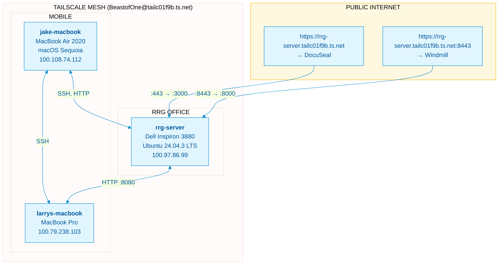
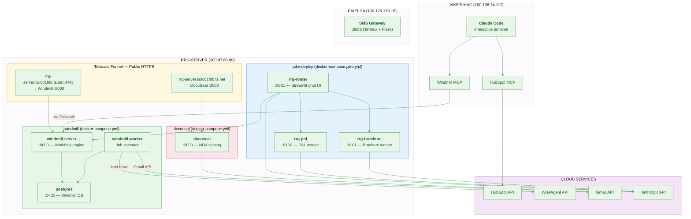
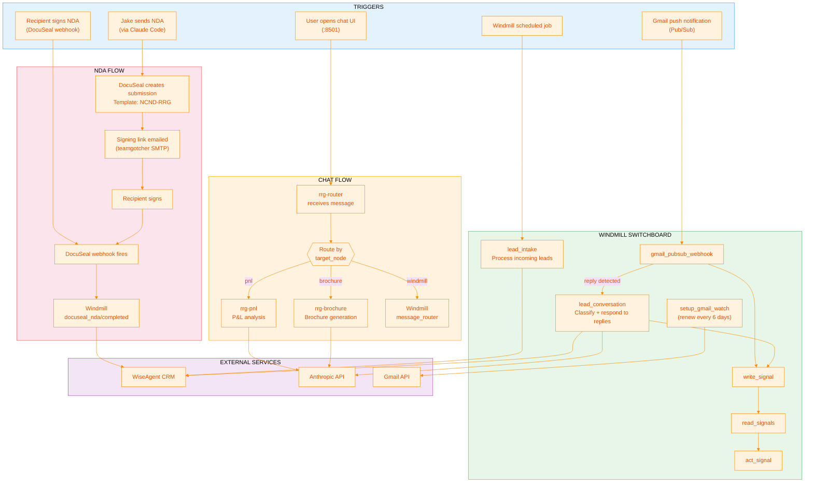
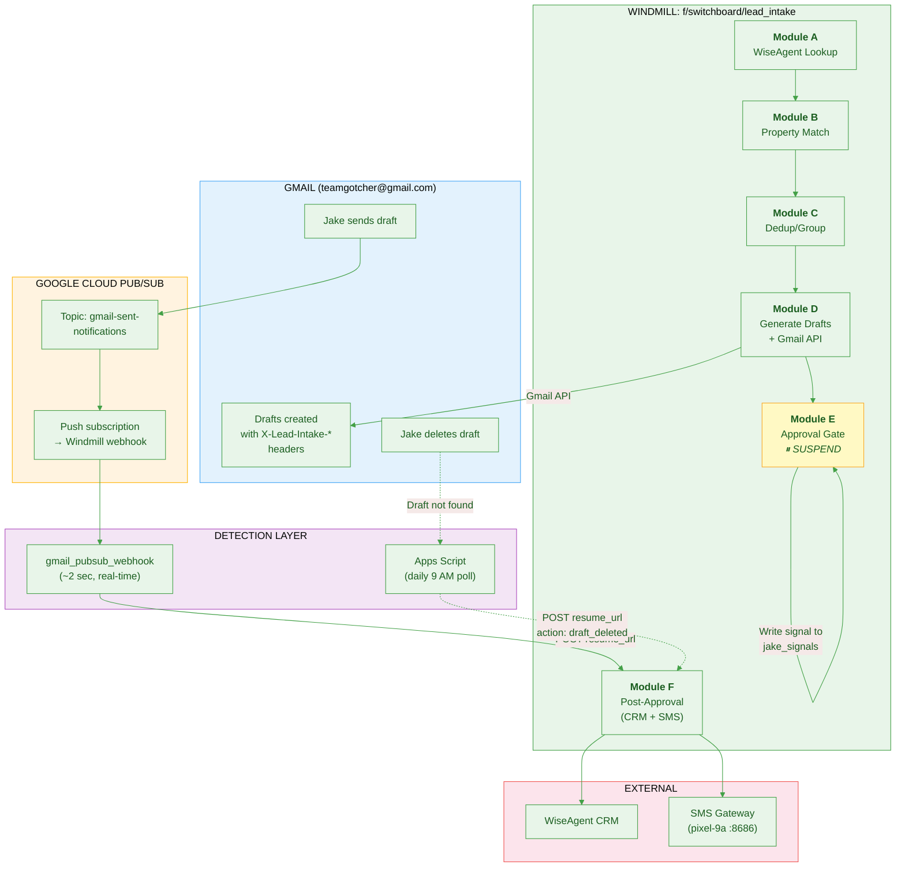
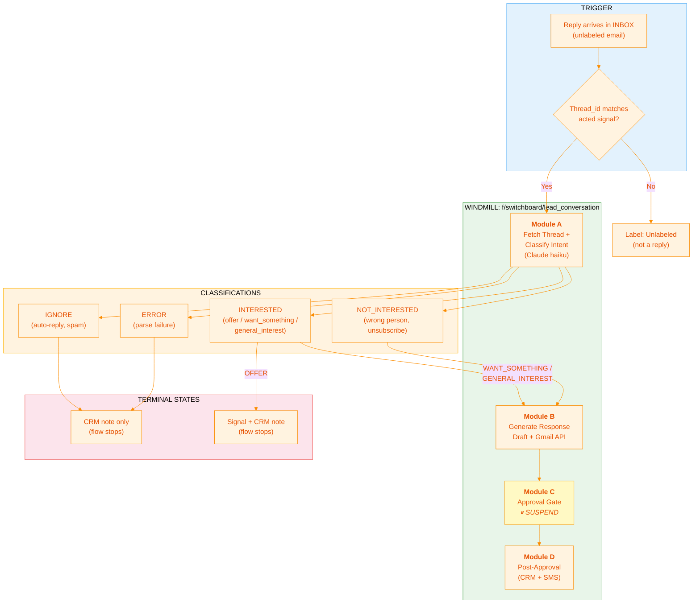

# RRG-Server Architecture

This document provides visual diagrams of the RRG-Server infrastructure across three layers.

> **Verified:** February 14, 2026 via SSH inspection of running system.

---

## Layer 1: Physical Infrastructure

The hardware and network topology connecting all devices.

### Key Points
- **RRG-Server** is at the RRG office, always on
- **Pixel 9a** (at the office) handles SMS for Crexi/LoopNet leads
- All inter-device communication uses **Tailscale IPs** (100.x.x.x)

---

## Layer 2: Service Topology

All services running on each device and their connections.

### Key Points
- **All RRG apps share the `windmill_default` Docker network** to communicate
- **rrg-router** is the entry point — routes chat messages to pnl/brochure workers
- **Source code lives on rrg-server** (`/home/andrea/rrg-*/`), images are built with Nix flakes on the server
- **DocuSeal source lives on the server** (`docuseal-src/`) — custom fork with RRG modifications
- **Windmill workflows live in Windmill's Postgres DB** — managed via Windmill UI or MCP
- **Tailscale Funnel** exposes DocuSeal (:443) and Windmill (:8443) publicly

---

## Layer 3: Application Workflows

The business logic — how services interact to accomplish tasks.

### Key Points
- **Chat flow** is the primary user-facing feature: Jake talks to rrg-router, which delegates to specialized workers
- **NDA flow** is self-contained: DocuSeal handles the full signing lifecycle
- **Windmill switchboard** handles background automation (lead intake, signal processing, Gmail webhooks)

---

## Lead Intake Pipeline (Detail)

The lead intake flow (`f/switchboard/lead_intake`) is the most complex workflow. It spans Windmill, Gmail, Google Cloud Pub/Sub, and a Google Apps Script. Full documentation: [`docs/LEAD_INTAKE_PIPELINE.md`](LEAD_INTAKE_PIPELINE.md).

The lead conversation engine (`f/switchboard/lead_conversation`) handles replies to outreach emails — classifying intent and generating response drafts. Full documentation: [`docs/LEAD_CONVERSATION_ENGINE.md`](LEAD_CONVERSATION_ENGINE.md).

## Lead Conversation Engine (Detail)

The conversation engine (`f/switchboard/lead_conversation`) processes replies to CRE outreach emails. Triggered by `gmail_pubsub_webhook` when an unlabeled INBOX email's thread_id matches an acted signal.

---

## Quick Reference

### Network

| Device | Tailscale IP | Location | Status |
|--------|-------------|----------|--------|
| rrg-server | 100.97.86.99 | RRG Office | **Online** |
| jake-macbook | 100.108.74.112 | Mobile | **Online** |
| pixel-9a | 100.125.176.16 | RRG Office | **Online** |
| larrys-macbook | 100.79.238.103 | Mobile | **Online** |

### Ports (RRG-Server)

| Port | Service | Exposure |
|------|---------|----------|
| 22 | SSH | Tailscale |
| 3000 | DocuSeal | Tailscale + Funnel (public HTTPS) |
| 5432 | Postgres (Windmill) | Internal only |
| 8000 | Windmill Server | Tailscale + Funnel (:8443 public HTTPS) |
| 8100 | rrg-pnl | Internal (Docker network) |
| 8101 | rrg-brochure | Internal (Docker network) |
| 8501 | rrg-router | Tailscale |

### Docker Compose Files

| File | Manages | Location on Server |
|------|---------|-------------------|
| `jake-deploy/docker-compose.jake.yml` | rrg-router, rrg-pnl, rrg-brochure | `/home/andrea/jake-deploy/` |
| `windmill/docker-compose.yml` | windmill-server, windmill-worker, postgres | `/home/andrea/windmill/` |
| `docuseal/docker-compose.yml` | docuseal (custom image) | `/home/andrea/docuseal/` |

### Source Code Locations

| Component | Source | Build | Deploy |
|-----------|--------|-------|--------|
| rrg-router | Server: `/home/andrea/rrg-router/` | `nix build` on server | `docker load < result` |
| rrg-pnl | Server: `/home/andrea/rrg-pnl/` | `nix build` on server | `docker load < result` |
| rrg-brochure | Server: `/home/andrea/rrg-brochure/` | `nix build` on server | `docker load < result` |
| DocuSeal (custom) | Server: `/home/andrea/docuseal/` | `nix build` on server | `docker load < result` |
| Windmill workflows | Windmill DB | Windmill UI/API | In-database |
| Deploy configs | Server: `jake-deploy/`, `windmill/`, `docuseal/` | N/A | `docker compose up -d` |

### Credentials

All credentials in `~/.secrets/jake-system.json` on Mac. Key ones for RRG-Server:

| What | Where to Find |
|------|---------------|
| SSH password | `tailscale.machines.rrg-server.ssh_users.andrea.password` |
| Windmill token | `windmill.api_token` |
| DocuSeal API key | `docuseal.api_key` |
| Claude OAuth token | `anthropic.claude_code_oauth_token` |
| DocuSeal SMTP | `docuseal.smtp` |
| WiFi password | artifact_8 |

### Disk Warning

As of Feb 14, 2026: **94% full (6.4GB free)**. Largest consumers:
- Docker images/data: ~14GB in `/var/lib/docker/`
- `docuseal-src/`: 693MB (full Ruby source + node_modules)
- `jake-images/`: 584MB (deployment tarballs)

---

*Last verified: February 20, 2026*
*Source: Direct SSH inspection + dataflow analysis*
