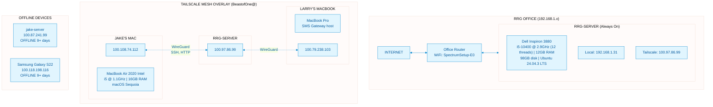
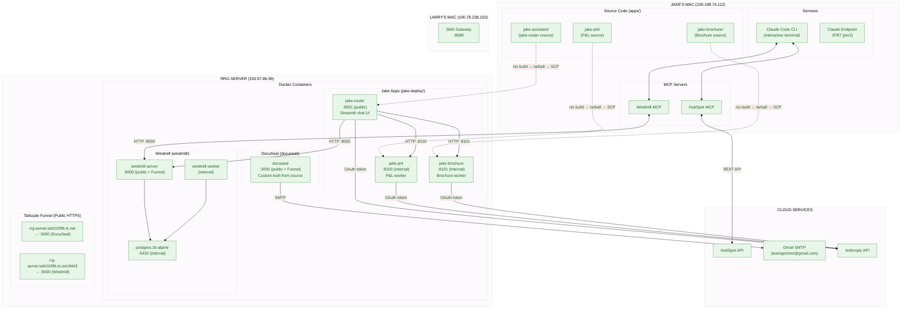
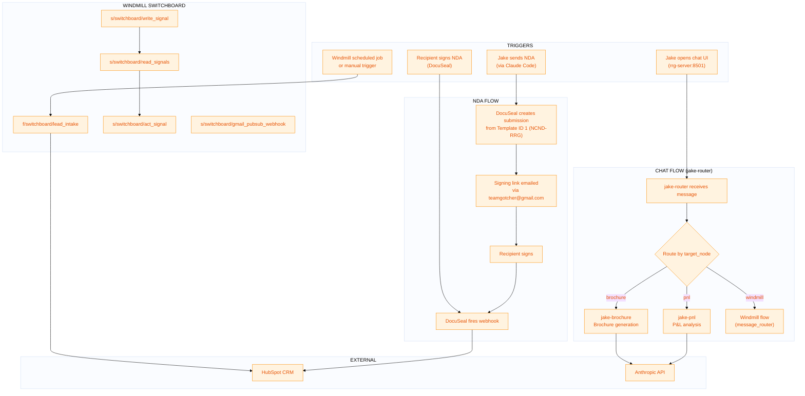

# RRG-Server Architecture

This document provides visual diagrams of the RRG-Server infrastructure across three layers.

> **Verified:** February 14, 2026 via SSH inspection of running system.
> **Relationship:** Loosely based on [jake-assistant-system](https://github.com/BeastofOne/jake-assistant-system/blob/main/docs/ARCHITECTURE.md) architecture.

---

## Layer 1: Physical Infrastructure

The hardware and network topology connecting all devices.

### Key Points
- **RRG-Server** is at the RRG office (not Jake's home)
- **jake-server** (Dell Latitude at home) is offline/paused — not part of this system
- **Larry's MacBook** hosts the SMS Gateway (replaced the Samsung phone)
- All inter-device communication uses **Tailscale IPs** (100.x.x.x)
- SSH access: `ssh andrea@100.97.86.99` (password: password)

---

## Layer 2: Service Topology

All services running on each device and their connections.

### Key Points
- **All jake apps share the `windmill_default` Docker network** to communicate
- **jake-router** is the entry point — routes chat messages to pnl/brochure workers
- **Source code lives on Mac**, images are built with Nix flakes, shipped as tarballs via SCP
- **DocuSeal source lives on the server** (`docuseal-src/`) — custom fork with RRG modifications
- **Windmill workflows live in Windmill's Postgres DB** — managed via Windmill UI or MCP
- **Tailscale Funnel** exposes DocuSeal (:443) and Windmill (:8443) publicly

---

## Layer 3: Application Workflows

The business logic — how services interact to accomplish tasks.

### Key Points
- **Chat flow** is the primary user-facing feature: Jake talks to jake-router, which delegates to specialized workers
- **NDA flow** is self-contained: DocuSeal handles the full signing lifecycle
- **Windmill switchboard** handles background automation (lead intake, signal processing, Gmail webhooks)
- **No n8n on RRG-Server** — that was jake-server only
- **No Inbox Zero on RRG-Server** — that was jake-server only

---

## Quick Reference

### Network

| Device | Tailscale IP | Location | Status |
|--------|-------------|----------|--------|
| rrg-server | 100.97.86.99 | RRG Office | **Online** |
| jake-macbook | 100.108.74.112 | Mobile | **Online** |
| larrys-macbook | 100.79.238.103 | Mobile | **Online** |
| jake-server | 100.87.241.99 | Jake's Home | Offline (paused) |
| samsung-phone | 100.118.198.116 | — | Offline |

### Ports (RRG-Server)

| Port | Service | Exposure |
|------|---------|----------|
| 22 | SSH | Tailscale |
| 3000 | DocuSeal | Tailscale + Funnel (public HTTPS) |
| 5432 | Postgres (Windmill) | Internal only |
| 8000 | Windmill Server | Tailscale + Funnel (:8443 public HTTPS) |
| 8100 | jake-pnl | Internal (Docker network) |
| 8101 | jake-brochure | Internal (Docker network) |
| 8501 | jake-router | Tailscale |

### Docker Compose Files

| File | Manages | Location on Server |
|------|---------|-------------------|
| `jake-deploy/docker-compose.jake.yml` | jake-router, jake-pnl, jake-brochure | `/home/andrea/jake-deploy/` |
| `windmill/docker-compose.yml` | windmill-server, windmill-worker, postgres | `/home/andrea/windmill/` |
| `docuseal/docker-compose.yml` | docuseal (custom image) | `/home/andrea/docuseal/` |

### Source Code Locations

| Component | Source | Build | Deploy |
|-----------|--------|-------|--------|
| jake-router | Mac: `apps/jake-assistant/` | `nix build` → `.tar.gz` | SCP to server, `docker load` |
| jake-pnl | Mac: `apps/jake-pnl/` | `nix build` → `.tar.gz` | SCP to server, `docker load` |
| jake-brochure | Mac: `apps/jake-brochure/` | `nix build` → `.tar.gz` | SCP to server, `docker load` |
| DocuSeal (custom) | Server: `docuseal-src/` | `docker build` on server | Local image `docuseal-rrg:latest` |
| Windmill workflows | Windmill DB | Windmill UI/API | In-database |
| Deploy configs | Server: `jake-deploy/`, `windmill/`, `docuseal/` | N/A | `docker compose up -d` |

### Credentials

All credentials in `~/.secrets/jake-system.json` on Mac. Key ones for RRG-Server:

| What | Where to Find |
|------|---------------|
| SSH password | `tailscale.machines.rrg-server.ssh_users.andrea.password` |
| Windmill token | `windmill.api_token` |
| DocuSeal API key | `docuseal.api_key` |
| Claude OAuth token | `anthropic.claude_code_oauth_token` |
| DocuSeal SMTP | `docuseal.smtp` |
| WiFi password | artifact_8 |

### Disk Warning

As of Feb 14, 2026: **94% full (6.4GB free)**. Largest consumers:
- Docker images/data: ~14GB in `/var/lib/docker/`
- `docuseal-src/`: 693MB (full Ruby source + node_modules)
- `jake-images/`: 584MB (deployment tarballs)

---

## What's NOT on RRG-Server (vs. jake-server)

These services ran on jake-server and are **not deployed** on RRG-Server:

| Service | Was On jake-server | Status |
|---------|-------------------|--------|
| n8n | :5678, 8 workflows | Not on RRG-Server |
| Inbox Zero | :3001 web, :5432 postgres, :redis | Not on RRG-Server |
| Inbox API | :3002, SQLite event queue | Not on RRG-Server |
| Pi-Hole | :53 DNS, :80 admin | Not on RRG-Server |
| LLM Intercept | n8n workflow → Claude Endpoint | Not on RRG-Server |
| SMS integration | n8n workflows for send/receive | Not on RRG-Server |
| Email automation | n8n Send Email workflow | Not on RRG-Server |

---

*Last verified: February 14, 2026*
*Source: Direct SSH inspection of running system*
